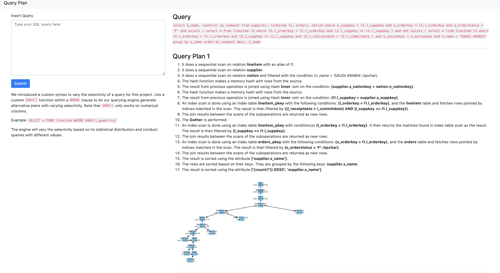

# database-query-visualizer

database-query-visualiser is database visualiser app for individuals who are interested in exploring how the database creates it query execution plan. database-query-visualiser also provides an easy to use interface for experimenting with running different queries and observing the execution plans.

## Raw Data

database-query-visualiser uses the [TPC-H](http://www.tpc.org/tpch/) raw data. Since the raw csv data is too large to be checked into VCS, download the data from [here](https://entuedu-my.sharepoint.com/:f:/g/personal/nlee016_e_ntu_edu_sg/Eu9asRzO8kVGkEYXAaafDbsBUCi4eUeKqyXawFfPnFoiog?e=O6jxY1) using your NTU office account.

## Quick start
The easiest way to do development on this repo is to use docker.

Download data from [here](https://entuedu-my.sharepoint.com/:f:/g/personal/nlee016_e_ntu_edu_sg/Eu9asRzO8kVGkEYXAaafDbsBUCi4eUeKqyXawFfPnFoiog?e=O6jxY1)
and extract them to `<project-root-folder-path>/sql/data/`

Set up the project and the database
~~~
docker-compose build && docker-compose up
~~~
Afterwards head to [url](http://localhost:5000/) 

NOTE: The csv files are huge --> Make sure that your docker engine has around 5gb worth of free space if not the creation of postgres tables will fail

## Local development
>TLDR: Install pipenv, install precommit, download data

This project uses pipenv to manage the dependencies. To install the repo requirements:
~~~
pipenv install
pipenv shell
~~~

Installing pre-commit hooks (Suggested)
~~~
pre-commit install
~~~

Download data from [here](https://entuedu-my.sharepoint.com/:f:/g/personal/nlee016_e_ntu_edu_sg/Eu9asRzO8kVGkEYXAaafDbsBUCi4eUeKqyXawFfPnFoiog?e=O6jxY1)
and extract them to `<project-root-folder-path>/sql/data/`

Running the prohect:
~~~
python client.py 
~~~

## FAQS

Q: How do i installing new dependencies?
~~~
pipenv install <dependency> 
pipenv install -d <dependency> 

The -d flag is used to specify development dependency
~~~

Q: How do i change which database the app points to?

~~~
Modify the .envs/dev.env file
~~~

Q: How do i set up the database for local testing?

~~~
Run the sql scripts in sql/scripts/ in the order :
  1-create_region.sql
  2-create_nation.sql
  3-create_part.sql
  4-create_supplier.sql
  5-create_partsupp.sql
  6-create_customer.sql
  7-create_orders.sql
  8-create_lineitem.sql
  9-analyze.sql
~~~

Q: My docker-compose database seems to be hanging?
~~~
As we are initializing the database and copying over a large amount of data from the TPC-H sample data, this process might take anywhere from 1-5 minutes. 

When the database copying is completed, the docker services should auto start.

~~~